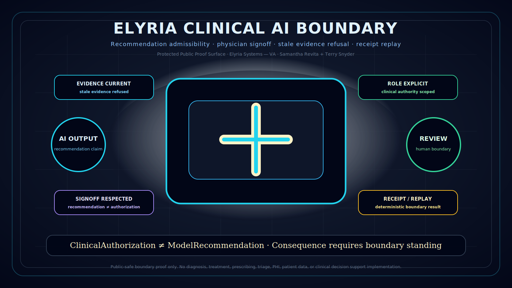

# Elyria Clinical AI Boundary


Built by **Elyria Systems — VA**.

Copyright (c) 2026 **Samantha Revita** and **Terry Snyder**. All rights reserved.

This repository is a **protected public proof surface**. It is **not open source**.

This repository is **not a medical AI tool**. It does not diagnose, treat, prescribe, triage, recommend care, or implement clinical decision support.



## What this is

Elyria Clinical AI Boundary is a public-safe boundary proof surface for clinical AI recommendation admissibility.

It defines whether a clinical AI output may proceed toward human clinical review, authorization, or consequence under controlled boundary conditions.

It does not decide care.

It does not replace clinicians.

It does not authorize treatment.

It governs the boundary before an AI output can be treated as clinical motion.

## Core claim

A model recommendation is not clinical authorization.

A clinical consequence may bind only after the required boundary conditions hold:

```text
evidence is current enough for the intended use
authority is valid
clinical role is explicit
physician signoff boundary is respected
stale evidence is refused
receipt binds the decision surface
replay can reproduce the boundary result
```

## Boundary formula

```text
ClinicalBoundaryPass =
  EvidenceCurrent
  AND AuthorityValid
  AND RoleExplicit
  AND PhysicianSignoffRespected
  AND RecommendationNotAuthorization
  AND ReceiptBound
  AND Replayable
  AND FailClosed
```

If boundary standing holds:

```text
ALLOW_REVIEW / ESCALATE_TO_HUMAN / RECEIPT / REPLAY
```

If boundary standing fails:

```text
REFUSE / HALT / QUARANTINE / ESCALATE / REBOUND
```

## Public proof surfaces

```text
CLINICAL_BOUNDARY_MODEL.md
PATTERN_STALE_CLINICAL_EVIDENCE.md
PATTERN_PHYSICIAN_SIGNOFF_COMMIT.md
PATTERN_RECOMMENDATION_NOT_AUTHORIZATION.md
PATTERN_CLINICAL_REPLAY_RECEIPT.md
ONE_CLINICAL_PROOF.md
NON_IMPLEMENTATION_NOTICE.md
clinical_boundary_register.json
```

## Public-safety boundary

This repository does not contain:

```text
patient data
PHI
diagnosis logic
treatment recommendation logic
medical scoring models
clinical decision support implementation
production integration code
private evaluator algorithms
```

## Protection boundary

This repository intentionally excludes:

```text
private runtime law
protected enforcement internals
customer-specific clinical policies
clinical deployment architecture
private law bundles
NDA-bound formal proofs
commercial pilot terms
live patient data
production secrets or credentials
private Veritas Aegis lineage materials
internal Elyria Systems — VA architecture
```

## Foundation lineage

```text
Elyria Systems = visible product surface
VA / Veritas Aegis = foundation and enforcement lineage beneath the product surface
```

## License posture

```text
Owner: Samantha Revita + Terry Snyder
System: Elyria Systems — VA
License posture: All rights reserved / protected public proof surface
Open-source status: Not open source
Medical-use status: Not authorized
Production use: Not authorized without written agreement
Commercial use: Not authorized without written agreement
Derivative use: Not authorized without written agreement
```

## Category statement

Elyria Clinical AI Boundary is a protected public proof surface for resolving whether a clinical AI output has admissible boundary standing before it may proceed toward human clinical review, authorization, or consequence.
